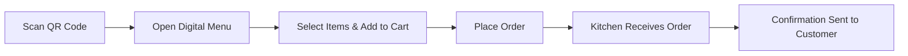

<!-- Improved & Modernized README -->
<div align="center">
  
  <h1>🍽️ QR Ordering System</h1>
  <p>
    <strong>Digital Table Ordering, Without the Wait</strong><br>
    Scan, Browse, Order. Instantly from your phone.
  </p>

  <!-- Badges -->
  <p>
    
    
    
  </p>
</div>

---

## ✨ Why QR Ordering System?

A modern, QR‑based ordering solution built for **restaurants, cafés, food courts, and small businesses**.  
Eliminate paper menus, reduce customer wait time, and streamline your service flow – all in real‑time.

---

## 📸 How It Works (User Journey)



---

🧩 Core Features

Category Feature
📱 Customer Side QR code scanning, digital menu, real‑time cart, order confirmation
🧑‍🍳 Restaurant Side Admin dashboard, live order feed, order status management
🤖 AI Integration Gemini AI for smart menu suggestions & order optimization
⚡ Performance Vite‑powered frontend, responsive UI, mobile‑first design
🔒 Security Environment variable protection, best practices for API keys

---

🛠️ Tech Stack

Frontend
https://img.shields.io/badge/Vite-646CFF?logo=vite&logoColor=white
https://img.shields.io/badge/TypeScript-3178C6?logo=typescript&logoColor=white
https://img.shields.io/badge/HTML5-E34F26?logo=html5&logoColor=white
https://img.shields.io/badge/CSS3-1572B6?logo=css3&logoColor=white

Backend
https://img.shields.io/badge/Node.js-339933?logo=nodedotjs&logoColor=white
https://img.shields.io/badge/Express-000000?logo=express&logoColor=white

AI & Services
https://img.shields.io/badge/Google%20Gemini-8E75B2?logo=googlegemini&logoColor=white

---

📂 Project Structure

```bash
QR-Ordering-System/
├── src/
│   ├── components/       # Reusable UI components
│   ├── pages/            # Route‑level views
│   ├── services/         # API calls, Gemini integration
│   ├── utils/            # Helpers & constants
│   └── assets/           # Images, fonts, etc.
├── server.ts             # Express entry point
├── package.json
├── vite.config.ts
├── tsconfig.json
└── .env.example          # Environment variable template
```

---

🚀 Quick Start

1. Clone & Install

```bash
git clone https://github.com/Strong-Bee/QR-Ordering-System.git
cd QR-Ordering-System
npm install
```

2. Environment Setup

```bash
cp .env.example .env.local
```

Open .env.local and insert your Gemini API key:

```env
GEMINI_API_KEY=your_gemini_api_key_here
```

3. Run Development Server

```bash
npm run dev
```

The app will be available at http://localhost:5173

---

⚙️ Production Deployment

```bash
npm run build
npm start
```

---

🎯 Perfect For

· 🍽️ Fine‑Dining Restaurants
· ☕ Cozy Cafés & Coffee Shops
· 🍜 Food Courts & Hawker Centers
· 🏨 Hotel Room Service
· 🛒 Self‑Service Kiosk Replacements

---

🔮 Roadmap

· Online Payment Integration (Midtrans, Stripe)
· Multi‑Branch / Multi‑Restaurant Support
· Table Management & Reservation
· Kitchen Display System (KDS)
· Push Notifications (WebSocket / Firebase)
· Customer Loyalty & Rewards
· Advanced Analytics Dashboard

---

🤝 Contributing

We welcome contributions! Please follow these steps:

1. Fork the repository
2. Create a feature branch: git checkout -b feature/amazing-feature
3. Commit your changes: git commit -m 'Add amazing feature'
4. Push to the branch: git push origin feature/amazing-feature
5. Open a Pull Request

---

📄 License

This project is licensed under the MIT License – see the LICENSE file for details.

---

👨‍💻 Author

Strong-Bee
https://img.shields.io/badge/GitHub-000?logo=github&style=for-the-badge

---

<div align="center">
  <sub>If you find this project helpful, please ⭐ star the repository!</sub>
</div>
```
